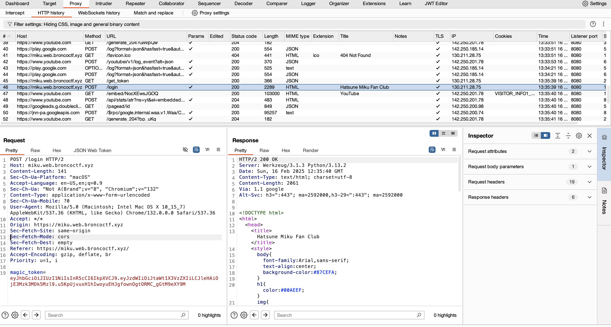
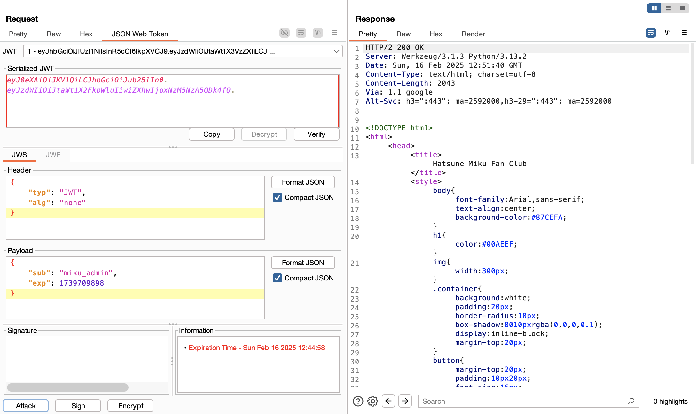
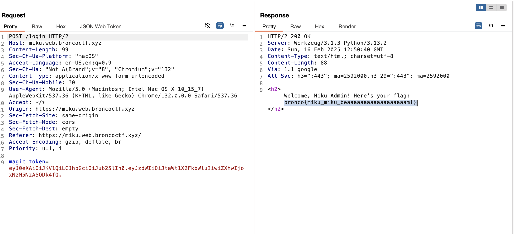

# **BroncoCTF 2025: Miku's Autograph**

### **Challenge about the JWT Weakness ☠️**  

This challenge exploits a common **JSON Web Token (JWT) vulnerability**, where the server incorrectly accepts `"none"` as a valid signing algorithm.  

Normally, JWTs are signed to prevent tampering. However, in this challenge, the **Miku Fan Club page** allows JWTs with `alg: "none"`, which means no signature verification is required.  

This allows us to **forge a token** and authenticate as `miku_admin` without needing the secret key.  

---

## **First Step: Getting a Valid JWT**  

When we first access the website, we see a response from `/get_token`, which provides a valid JWT. The website uses this token for authentication.  

📌 **Captured Response from `/get_token`**  

  

---

## **Second Step: Exploiting the JWT "None" Algorithm Vulnerability**  

### **Identifying the Vulnerability**  

The first thing you should check when encountering a JWT-based authentication system is whether the **"none" algorithm vulnerability** exists.  

A secure implementation **never** allows `"none"` as a valid algorithm. However, in this case, the server **accepts unsigned JWTs**, meaning we can manipulate them freely.  

### **Modifying the JWT with Burp Suite**  

To exploit this, I used **Burp Suite’s JWT Extension** to modify the token and escalate privileges.  

📌 **Modifying the JWT in Burp Suite**  
  

### **Steps to Modify the JWT:**  
1. **Decode the JWT** using Burp Suite’s **JWT Editor** or `jwt.io`.  
2. **Modify the JWT Header** to disable signature validation:  
   ```json
   { "alg": "none", "typ": "JWT" }
   ```
3. **Modify the JWT Payload to escalate privileges:**
   ```json
   { "sub": "miku_admin" }
   ```
4. **Remove the signature entirely and create the final unsigned JWT:**
   ```json
    base64(header).base64(payload).
   ```

## **Last Step: Sending the Forged JWT**

- Replace the original JWT in the request with our modified **unsigned JWT**.
- Send the request using **Burp Suite**.
- If successful, the server **authenticates us as `miku_admin`**, granting **admin access**.

📌 **Sending the Forged JWT**  
  

---

## **Final Step: Retrieving the Flag**

Now that we are logged in as **`miku_admin`**, we can access the **flag retrieval endpoint** (e.g., `/admin` or `/get_flag`).

📌 **Success! The Flag is Revealed 🎉**
```
bronco{miku_miku_beaaaaaaaaaaaaaaaaaam!}
``` 

---

## **Conclusion**

This challenge demonstrates a real-world security flaw in JWT authentication.

💡 **Key Takeaways:**

- A properly secured JWT **must not allow `"none"`** as a valid algorithm.
- The server **must enforce signature verification** to prevent privilege escalation.
- Always check for **JWT misconfigurations** when testing authentication security.

✅ **Fix:** The server should reject tokens where `alg: "none"` is set and enforce strict validation using a strong secret key.

