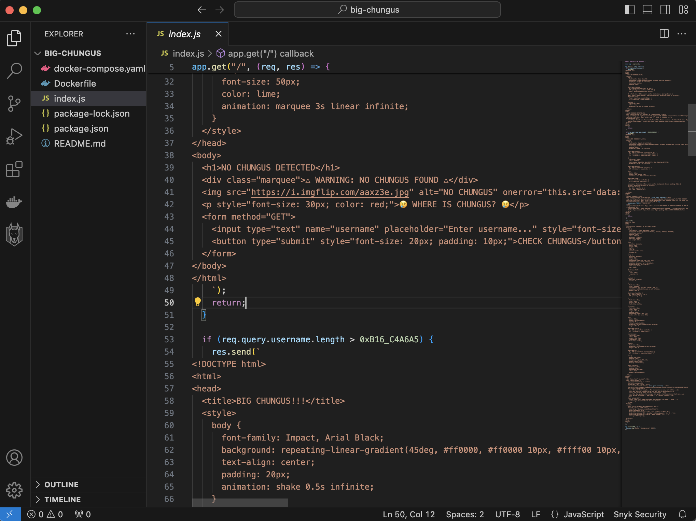
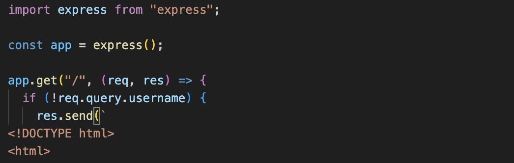
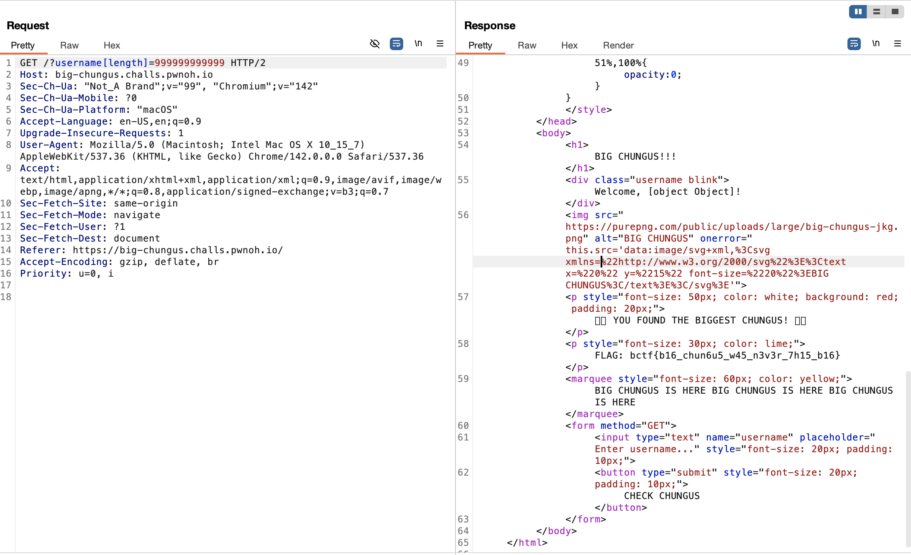

# BuckeyeCTF 2025 : big chunks (web challenge)

## The Website Code – the condition that will display the flag:


##### Where is the vulnerability?  
Yeah, the check requires the username to be **over 47 billion characters**, which is obviously impossible to send normally.

##### But if you look closely, the server uses Express with the well-known parsing library **qs**:


#### Let's explain how `qs` works:

**Normal query:**
``` ?Username=alice ```

##### Result:  
`req.query.username = "alice"` (a string)

---

**Special syntax – Object property injection:**
``` ?Username[length]=999999999999 ```

##### Result:  
`req.query.username = { length: 999999999999 }`  
Now `username` is **an object**, not a string, and you directly control its `.length` property.

---

Because the server only checks `username.length > 47483647246282`, you can bypass the intended limit by supplying a fake length through `qs` object syntax, without sending a huge string.

### Final Result 


# Wow, flag! hehe heckkkerr.  
Thanks for reading.