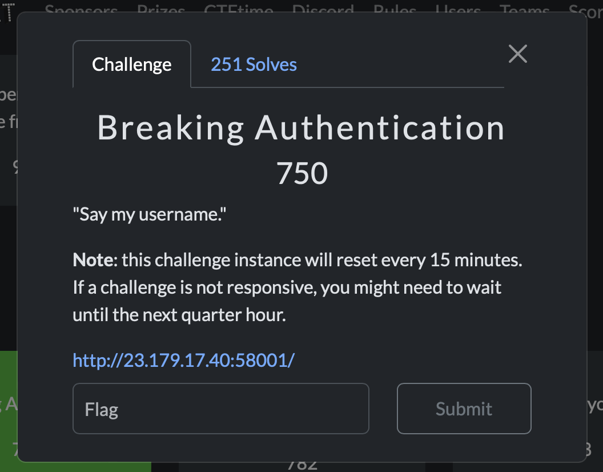
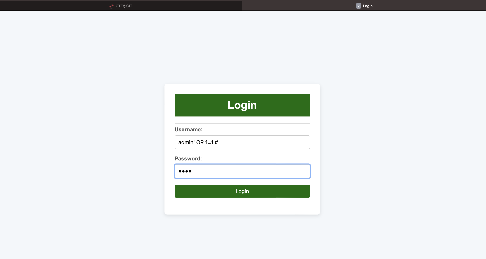
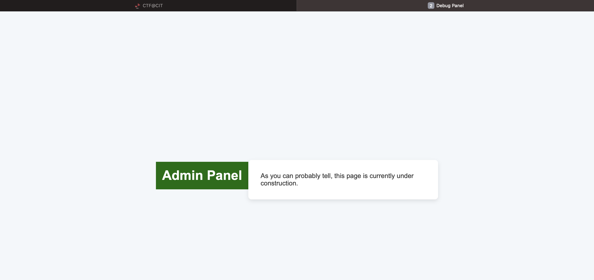
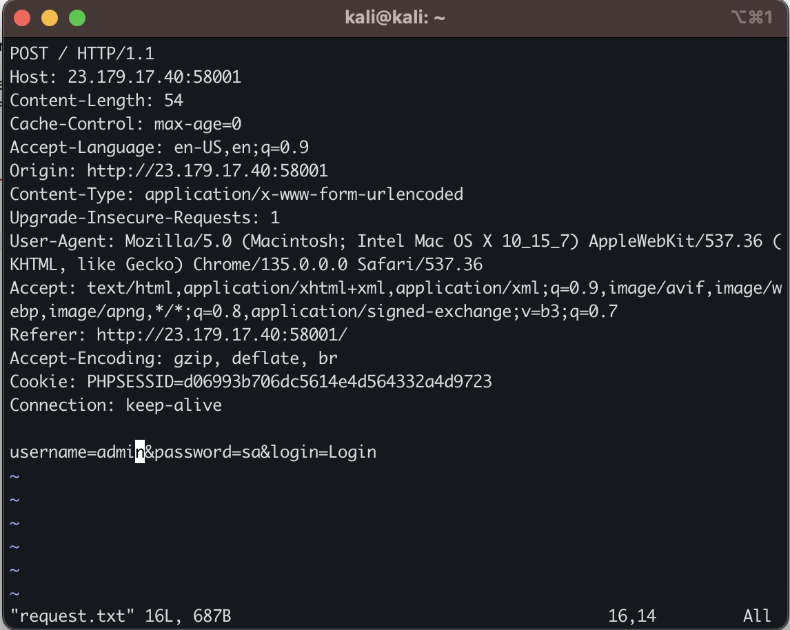
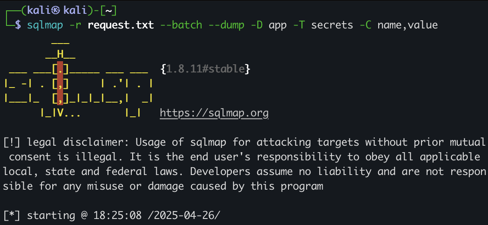
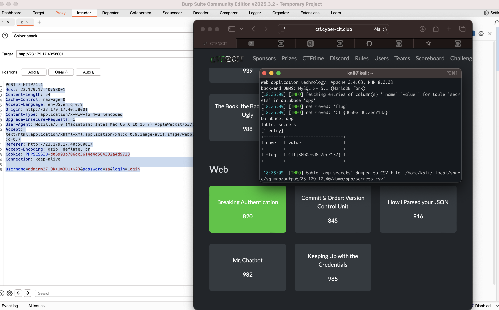

# CIT@CTF 2025: Breaking Auth 🛡️

## Challenge



---

## Explaining Easy Access to the Database with SQLi

First, I tried the famous SQLi test, and here is the result:

  


This made me trust that there was a SQL Injection vulnerability on the website, and that I could get access to the database.

## Sqlmap Made My Life Easy (MiniSqlmap by Me Coming Soon!)

### I did these steps that led me to the final result:

*Firstly*, I caught the request that contained the parameters that were exploitable:



Then, I ran:
```bash
sqlmap -r request.txt --batch 
```

after testing the SQL injection worked.

*Secondly*, I needed to know what databases were in the main database server.
I used:

```bash
sqlmap -r request.txt --batch --dbs
```

Then I found that the main database of the web application was called app.
I used this command to find what tables existed in the app database:

```bash
sqlmap -r request.txt --batch -D app --tables
```

I noticed there were two tables: one related to usernames, and the other related to secrets.

I searched in both tables and finally found the flag!



# Result :



## Thank you Bro for reading 🏴‍☠️🥷🏻