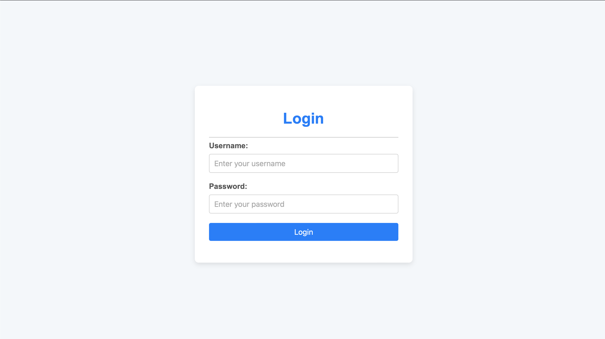
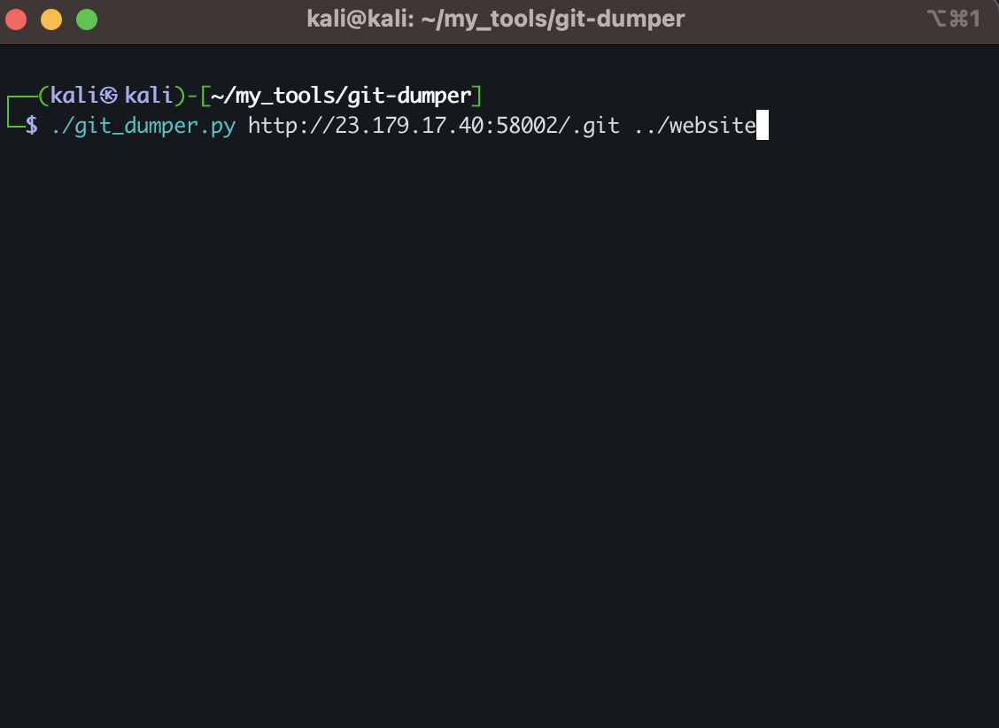
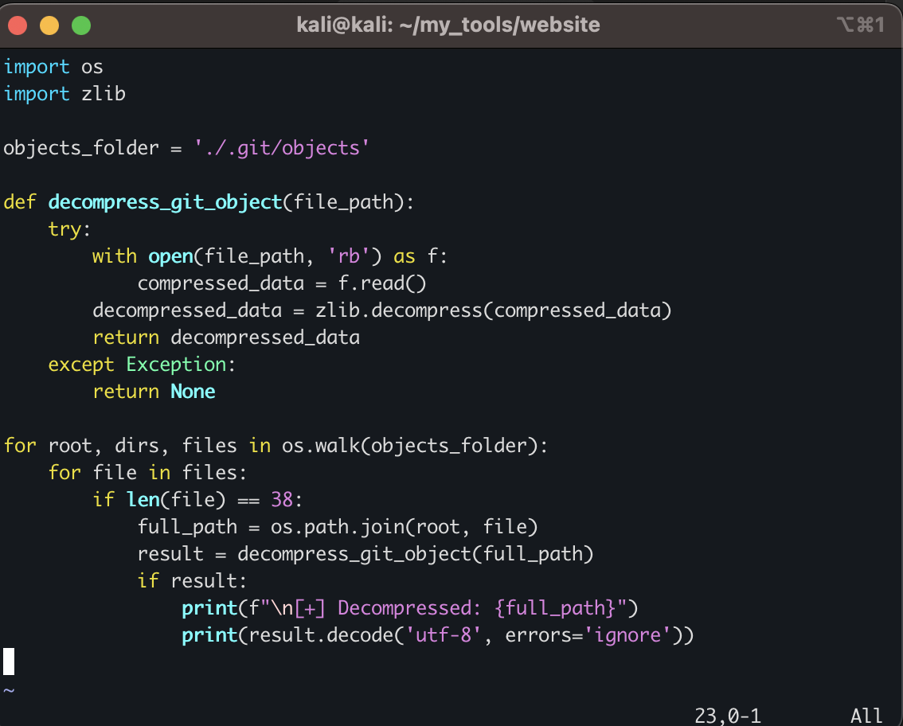

# CIT@CTF 2025: Commit & Order — Version Control Unit

## Challenge


---

## Interface



---

## First Attempts

At first, I tried many common vulnerabilities such as *SQL Injection, **CSRF, and **XSS*, but none of them seemed to work.

If you carefully notice in the challenge description, they mention that the problem is somehow *related to Git branches*.  
This hint made me think about the possible exposure of a *⁠ .git/ ⁠* directory on the web server.

---

## Accessing ⁠ .git/HEAD ⁠

My first attempt was accessing ⁠ /.git/ ⁠.  
The server responded, but it was *forbidden* (403 error).

Then I thought:  
"Maybe if I directly request specific Git files, I can bypass the directory listing protection."

So, I tried accessing ⁠ /.git/HEAD ⁠, and it worked:


The content was:

This confirmed that the Git repository structure exists and is accessible!

---

## Dumping the Git Repository

To automate downloading the Git repository, I used a tool called [⁠ git-dumper ⁠](https://github.com/arthaud/git-dumper).

Here is the command I used to dump the Git repository:



This tool fetched all accessible Git objects, references, and essential files from the exposed server.

---

## Analyzing the Dumped Files

After successfully dumping the ⁠ .git/ ⁠ directory, I explored its structure.


Inside ⁠ .git/objects/ ⁠, I found many files — Git stores commits, trees, blobs, and tags inside this folder in a *compressed format* (using ⁠ zlib ⁠).


These files needed to be *decompressed* in order to read their content.
---



## Python Script to Decompress Git Objects

To automate this, I wrote a Python script:

```
⁠python
import os
import zlib

objects_folder = './.git/objects'

def decompress_git_object(file_path):
    try:
        with open(file_path, 'rb') as f:
            compressed_data = f.read()
        decompressed_data = zlib.decompress(compressed_data)
        return decompressed_data
    except Exception:
        return None

for root, dirs, files in os.walk(objects_folder):
    for file in files:
        if len(file) == 38:
            full_path = os.path.join(root, file)
            result = decompress_git_object(full_path)
            if result:
                print(f"\n[+] Decompressed: {full_path}")
                print(result.decode('utf-8', errors='ignore'))
```
## Analyzing the decompressed files

there credentials of admin :


Then i noticed something suspicious :


i went straight to transfer it to text and the flag is show up :


## Thank You for reading 